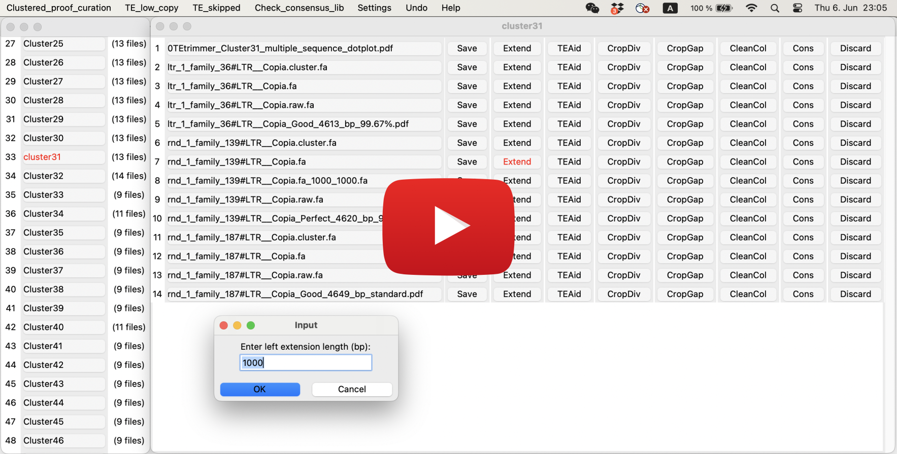
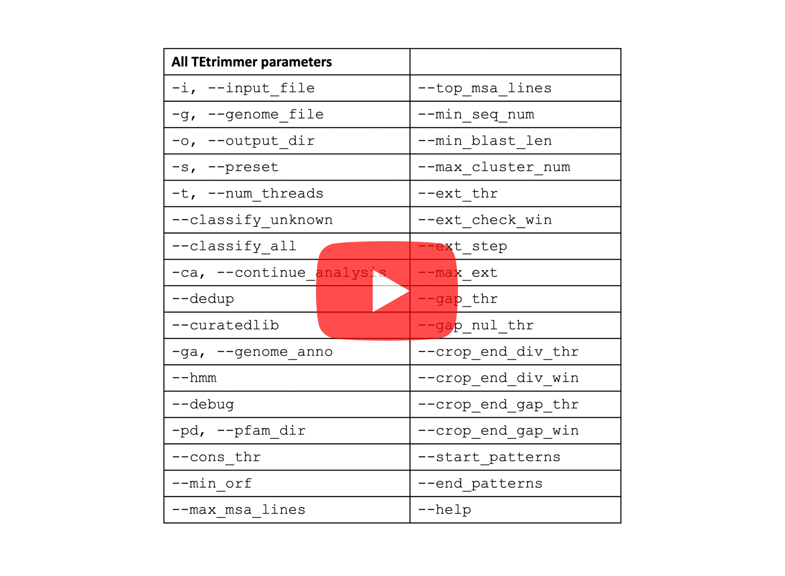

[](https://anaconda.org/bioconda/tetrimmer)
[](https://quay.io/repository/biocontainers/tetrimmer?tab=tags&tag=1.4.0--hdfd78af_0)
[](./LICENSE)
[](./docs/TEtrimmerv1.4.0Manual.pdf)


## Contents
- [Introduction](#Introduction)
- [Installation](#Installation)
- [Usage](#Usage)
  - [Test](#Test)
  - [Hardware requirements](#Hardware-requirements)
  - [Inputs](#Inputs) 
  - [Outputs](#Outputs)
  - [Proof curation](#Proof-annotation)
- [All available options](#All-available-options)
- [Update history](#Update-history)
- [Citation](#Citation)

## Introduction
Many tools have been developed for the discovery and annotation of transposable elements (TEs). 
However, the high-quality TE consensus library construction still requires manual curation of TEs, 
which is time-consuming and needs experts with an in-depth understanding of TE biology. 


TEtrimmer is a powerful software designed to automate the manual curation of TEs. The input can be a TE library from 
*de novo* TE discovery tools, such as EDTA and RepeatModeler2, or a TE library from closely related species. 
For each input consensus sequence, TEtrimmer automatically performs BLASTN search,  sequence extraction, extension, 
multiple sequence alignment (MSA), MSA clustering, MSA cleaning, TE boundary definition, and TE classification. 
TEtrimmer also provides a graphical user interface (GUI) to inspect and improve predicted TEs, which can assist 
achieving manual curation-level TE consensus libraries easily. 

[](https://www.youtube.com/watch?v=PgKw76gmzl8&t=17s&ab_channel=ZhaoJiang)

## Installation 
TEtrimmer can be installed by 1. Conda, 2. Singularity, or 3. Docker. 

### 1. Conda (Many thanks to [HangXue](https://github.com/hangxue-wustl))
You have to install [miniconda](https://docs.anaconda.com/free/miniconda/) on your computer in advance. 
We highly recommend installation with `mamba`, as it is much faster. 

```commandline
# Create new conda environment
conda create --name TEtrimmer python=3.10 samtools=1.22.1

# Install mamba 
conda install -c conda-forge mamba 

# Activate new environment
conda activate TEtrimmer

# Install TEtrimmer
mamba install bioconda::tetrimmer

# Display options of TETrimmer 
TEtrimmer --help

# If you encounter "ClobberError" or "ClobberWarning", don't worry! wait until it is finished!
# The Error or Warning could be like this:
ClobberError: This transaction has incompatible packages due to a shared path.
  packages: bioconda/osx-64::blast-2.5.0-boost1.64_2, bioconda/osx-64::rmblast-2.14.1-hd94f91d_0
  path: 'bin/blastx'
  

# The bioconda::tetrimmer package includes the TEtrimmer source code, but the version inside may be outdated.
# If you want to run the latest version of TEtrimmer via the bioconda::tetrimmer environment
# Clone the new version of TEtrimmer from Github

git clone https://github.com/qjiangzhao/TEtrimmer.git

# Run the cloned TEtrimmer inside the bioconda::tetrimmer environment
conda activate TEtrimmer

python <your_path_to_cloned_TEtrimmer_folder_which_contain_TEtrimmer.py>/TEtrimmer.py --help


```
**or** See required dependencies [TEtrimmer_dependencies](https://github.com/qjiangzhao/TEtrimmer/blob/main/docs/TEtrimmer_dependencies).

**or** conda installation via .yml

```commandline
# Clone the github repository for TEtrimmer.
git clone https://github.com/qjiangzhao/TEtrimmer.git

# Install mamba 
conda install -c conda-forge mamba

# Install TEtrimmer by the "yml" file
mamba env create -f <path to/TEtrimmer_env.yml>
```
Here is the provided [TEtrimmer_env.yml](./TEtrimmer_env.yml)

### 2. Singularity
```commandline
# Download and generate TEtrimmer "sif" file
singularity pull docker://quay.io/biocontainers/tetrimmer:1.4.0--hdfd78af_0

# Run TEtrimmer based on sif file 
# If <your_path_to_store_PFAM_database> doesn't contain PFAM database
# TEtrimmer can automatically download PFAM to <your_path_to_store_PFAM_database>

singularity exec --writable-tmpfs \
--bind <your_path_contain_genome_file>:/genome \
--bind <your_path_contain_input_TE_library_file>:/input \
--bind <your_output_path>:/output \
--bind <your_path_to_store_PFAM_database>:/pfam \  
<your_path_contain_sif_file>/tetrimmer_1.4.0--hdfd78af_0.sif \
TEtrimmer \
-i /input/<TE_library_name.fasta> \
-g /genome/<genome_file_name.fasta> \
-o /output \
--pfam_dir /pfam \
-t 20 --classify_all

# The Singularity image includes the TEtrimmer source code, but the version inside may be outdated.
# If you want to run the latest version of TEtrimmer via the singularity image
# Clone the new version of TEtrimmer from Github

git clone https://github.com/qjiangzhao/TEtrimmer.git

singularity exec --writable-tmpfs \
--bind <your_path_to_cloned_TEtrimmer_folder_which_contain_TEtrimmer.py>:/TEtrimmer_cloned \
--bind <your_path_contain_genome_file>:/genome \
--bind <your_path_contain_input_TE_library_file>:/input \
--bind <your_output_path>:/output \
--bind <your_path_to_store_PFAM_database>:/pfam \  
<your_path_contain_sif_file>/tetrimmer_1.4.0--hdfd78af_0.sif \
python TEtrimmer_cloned/TEtrimmer.py \
-i /input/<TE_library_name.fasta> \
-g /genome/<genome_file_name.fasta> \
-o /output \
--pfam_dir /pfam \
-t 20 --classify_all

```
### 3. Docker 
```commandline
# Download TEtrimmer docker image
docker pull quay.io/biocontainers/tetrimmer:1.4.0--hdfd78af_0
docker run -it --name TEtrimmer -v <bind_your_path>:/data quay.io/biocontainers/tetrimmer:1.4.0--hdfd78af_0
# Then you can run TEtrimmer inside TEtrimmer container
# Please note: Run TEtrimmer via Docker is relatively slower than Conda and Singularity. 
```

## Runtime test

We evaluated the runtime performance of TEtrimmer on genomes of four organisms, i.e., 
*D. melanogaster*, *D. rerio*, *O. sativa*, and *B. hordei*. For each genome, the analysis was executed three times 
using a compute node allocated via SLURM with 48 CPU cores (Intel Xeon 8468 Sapphire) and 140 GB of RAM. 
Runtime and output size were recorded for each repetition, and the mean and standard deviation were calculated across the three runs. 

| Species           | Genome size (Mbp) | EDTA Input TE number | EDTA+TEtrimmer Runtime (h) | EDTA+TEtrimmer Output size (GB) | RM2 Input TE number | RM2+TEtrimmer Runtime (h) | RM2+TEtrimmer Output size (GB) |
|-------------------|-------------------|----------------------|----------------------------|---------------------------------|---------------------|---------------------------|--------------------------------|
| *B. hordei*       | 124               | 996                  | 0.92 ± 0.049               | 2.30                            | 818                 | 0.83 ± 0.040              | 2.10                           |
| *D. melanogaster* | 144               | 819                  | 0.66 ± 0.067               | 0.92                            | 480                 | 0.66 ± 0.046              | 0.96                           |
| *D. rerio*        | 1,679             | 8,631                | 4.95 ± 0.225               | 15.10                           | 3,504               | 2.32 ± 0.066              | 5.50                           |
| *O. sativa*       | 373               | 10,404               | 3.30 ± 0.200               | 7.30                            | 2,334               | 1.31 ± 0.090              | 2.50                           |


## Test
```commandline
# To see all options 
TEtrimmer --help
```
**or**
```commandline
# To see all options 
python <path to TEtrimmer>/TEtrimmer.py --help
```
- Download the test files [test_input.fa](https://github.com/qjiangzhao/TEtrimmer/blob/main/tests/test_input.fa) and [test_genome.fa](https://github.com/qjiangzhao/TEtrimmer/blob/main/tests/test_genome.fa).

```commandline
TEtrimmer --input_file <path to test_input.fa> \
          --genome_file <path to test_genome.fasta> \
          --output_dir <output directory> \
          --num_threads 20
          --classify_all                                          
```
## Inputs
- **Genome file**: The genome sequence in FASTA format (.fa or .fasta).
- **TE consensus library**: TEtrimmer uses the TE consensus library from *de novo* TE annotation tools, like `RepeatModeler` or `EDTA`, as input. 
For this reason, you have to run `RepeatModeler` or other TE annotation software first.

```commandline
# TEtrimmer package already includes RepeatModeler. Below is an exmpale command of running RepeatModeler.
# Build genome database index files
BuildDatabase -name <genome_file_database_name> <genome_file.fa>

# Run RepeatModeler
RepeatModeler -database <genome_file_database_name> \
              -threads 20 \
              -LTRStruct
# Then you will get the TE_consensus_library.fa file
```

Example:

```commandline
TEtrimmer --input_file <TE_consensus_library.fa> \
          --genome_file <genome_file.fa> \
          --output_dir <output_directory> \
          --num_threads 20 \
          --classify_all                       
```
If you want to **continue the analysis based on previous unfinished results in the same directory:**:
```commandline
TEtrimmer --input_file <TE_consensus_library.fa> \
          --genome_file <genome_file.fa> \
          --output_dir <directory_contains_previous_unfinished_results> \
          --num_threads 20 \
          --classify_all \
          --continue_analysis
```
If you want to **combine files from different sources for the input file, we recommend removing duplicate sequences 
before processing. This step can potentially save overall run time in the input file** (TEtrimmer only accepts single file
input, you have to combine files in advance):
```commandline
TEtrimmer --input_file <TE_consensus_library.fa> \
          --genome_file <genome_file.fa> \
          --output_dir <output_directory> \
          --num_threads 20 \
          --classify_all
          --dedup    
```

## Outputs
- 📁**Classification** - *This folder is used for TE classifications.*  
- 📁**Multiple_sequence_alignment** - *All raw files will be stored in this folder if < --debug > is enabled.*
  - 📄**error_file.txt** - *Error file to store all error messages, only visible if errors were found.*
- 📁**Single_fasta_files** - *All sequences in the input file will be separated into single FASTA files and stored here.*
- 📁**TEtrimmer_for_proof_curation** - *This folder contains files used for manual inspection of TEtrimmer annotations.* 
  - 📁**Annotation_perfect** - *Four files are associated with each sequence as showed below.*
    - 📄**TE_name.raw.fa** - *Multiple sequence alignment file before TE boundary definition.*
    - 📄**TE_name.fa** - *Multiple sequence alignment file after TE boundary definition, which is used to generate the consensus sequence.*
    - 📄**TE_name.pdf** - *Plot file used to evaluate output.*
    - 📄**TE_name.cluster.fa** - *Multiple sequence alignment file before clustering.*
  - 📁**Annotation_good** 
  - 📁**Annotation_check_recommended**
  - 📁**Annotation_check_required**
  - 📁**Clustered_proof_curation** - *This folder contains all the output files from folder "Annotation_perfect", "Annotation_good", "Annotation_check_recommended", and "Annotation_check_required". The difference is TEtrimmer group similar output TEs into one "Cluster", which can make it easier to compare similar outputs.*
  - 📁**TE_low_copy** - *This folder contains low copy TEs.*
  - 📁**TE_skipped** - *Contains TE_Aid plots for all skipped TEs.*
- 📁**HMM** - *This folder is used to store Hidden Markov Model file. Only visible when < --hmm > is enabled.*
- 📄**Sequence_name_mapping.txt** - *This file connects the input sequence names with the modified names from TEtrimmer.*
- 📄**summary.txt** - *Summary file.* 
- 📄**TEtrimmer_consensus.fasta** - *TE consensus library file before de-duplication.*
- 📄**TEtrimmer_consensus_merged.fasta** - *TE consensus library file after de-duplication.*

**Example Summary.txt**

| input_name                | output_name               |   input_blast_n |   input_full_blast_n |   output_blast_n |   output_full_blast_n |   input_genome_cov_len |   output_genome_cov_len |   output_MSA_seq_n |   input_length |   output_length |   in_out_identify |   input_coverage |   output_coverage | input_TE_type   | output_TE_type   | input_terminal_repeat   | output_terminal_repeat   |   TSD | start_pattern   | end_pattern   | low_copy   | evaluation   | cluster   | cluster_identity   | status    |
|:--------------------------|:--------------------------|----------------:|---------------------:|-----------------:|----------------------:|-----------------------:|------------------------:|-------------------:|---------------:|----------------:|------------------:|-----------------:|------------------:|:----------------|:-----------------|:------------------------|:-------------------------|------:|:----------------|:--------------|:-----------|:-------------|:----------|:-------------------|:----------|
| TE_00000661               | TE_00000661               |            1845 |                    0 |             2945 |                   945 |                 448202 |                 1228079 |                 11 |           4055 |             690 |             82.65 |            16.84 |            100    | DNA/DTM         | DNA/DTM          | FALSE                   | FALSE                    |   nan | nan             | nan           | False      | Need_check   | Cluster1  | standard           | processed |
| TE_00000661               | TE_00000661_01            |            1845 |                    0 |             3302 |                  1148 |                 448202 |                 1343913 |                 18 |           4055 |             679 |             84.12 |            16.94 |            100    | DNA/DTM         | DNA/DTM          | FALSE                   | FALSE                    |   nan | nan             | nan           | False      | Need_check   | Cluster1  | 93.67%             | processed |
| TE_00000663_INT           | TE_00000663_INT           |             158 |                   47 |              407 |                    41 |                 189303 |                  443240 |                 69 |           2814 |            6339 |             93.61 |           100    |             46.05 | LTR/Gypsy       | LTR/Gypsy        | FALSE                   | LTR                      |   nan | TG              | CA            | False      | Perfect      | Cluster11 | standard           | processed |
| TE_00000654_INT           | TE_00000654_INT           |              64 |                    1 |              656 |                    20 |                  26794 |                  359392 |                 56 |            996 |            5081 |             83.21 |           100    |             21.14 | LTR/Gypsy       | LTR/Gypsy        | FALSE                   | LTR                      |   nan | TG              | CA            | False      | Perfect      | Cluster12 | standard           | processed |
| TE_00000653_INT           | TE_00000653_INT_01        |              65 |                   22 |              858 |                     8 |                  55147 |                  351333 |                 17 |           1775 |            5127 |             79.1  |            99.94 |             34.45 | LTR/Copia       | LTR/Copia        | FALSE                   | LTR                      |   nan | TG              | CA            | False      | Good         | Cluster13 | standard           | processed |
| TE_00000648_INT           | TE_00000648_INT           |              55 |                    0 |              736 |                    27 |                  77711 |                  350046 |                 49 |           1839 |            5859 |             91.39 |            99.95 |             33.01 | LTR/Gypsy       | LTR/Gypsy        | FALSE                   | LTR                      |   nan | TG              | CA            | False      | Perfect      | Cluster14 | standard           | processed |
| TE_00000653_INT           | TE_00000653_INT           |              65 |                   22 |              862 |                    17 |                  55147 |                  308295 |                 31 |           1775 |            5063 |            100    |           100    |             35.06 | LTR/Copia       | LTR/Copia        | FALSE                   | LTR                      |   nan | TG              | CA            | False      | Perfect      | Cluster15 | standard           | processed |
| TE_00000664_INT           | TE_00000664_INT           |              64 |                   15 |             1011 |                     0 |                  31612 |                  290126 |                 22 |           1357 |            8009 |             95.11 |           100    |             17.59 | LTR/Gypsy       | LTR/Gypsy        | FALSE                   | LTR                      |   nan | FALSE           | FALSE         | False      | Need_check   | Cluster17 | standard           | processed |
| TE_00000659_INT           | TE_00000659_INT_01        |             907 |                    0 |              468 |                    17 |                 216634 |                  288770 |                 26 |           5156 |            5553 |             60.69 |            99.88 |             93.64 | LTR/unknown     | LTR/unknown      | FALSE                   | LTR                      |   nan | TG              | CA            | False      | Good         | Cluster18 | standard           | processed |


## Optional! But recommended! Manual inspection of TEtrimmer outputs by provided TEtrimmerGUI. 
You can use the TEtrimmerGUI tool to inspect and improve TEtrimmer generated TE consensus library. 
TEtrimmer output can be used for genome-wide TE annotation directly. 
But if you want to get a traditional manual-curation level TE consensus library, you have to perform this step.
Especially for LINE and SINE elements.

### Start TEtrimmerGUI 

```commandline
# Use --help to see all options
python <path_to_folder_tetrimmerGUI>/TEtrimmerGUI.py --help

# To start the manual inspection GUI tool
# Open your Linux, macOS, or Windows terminal and type
python <path_to_folder_tetrimmerGUI>/TEtrimmerGUI.py -i <TEtrimmer_for_proof_curation_folder> -g <genome_file.fa>
```
TEtrimmerGUI doesn't need any dependencies. You can copy the "tetrimmerGUI" folder to any place and execute it directly.
[](https://www.youtube.com/watch?v=52GYZUQyzSE&t=1608s&ab_channel=ZhaoJiang)


## Example report plots for each output TE consensus sequence
For each TEtrimmer output TE consensus sequence. You will get a report plot file like this:


## Acknowledgements
Many thanks to all the people who contributed to the TEtrimmer development. 

## All available options 
We provided tutorial video to introduce the TEtrimmer parameters.
[](https://www.youtube.com/watch?v=8jp3j5FFf1w&t=1114s)

```commandline
Options:
  -i, --input_file TEXT           Path to TE consensus file (FASTA format). Use the output from
                                  RepeatModeler, EDTA, REPET, et al.  [required]

  -g, --genome_file TEXT          Path to genome FASTA file (FASTA format).  [required]

  -o, --output_dir TEXT           Path to output directory. Default: current working directory.
  
  -s, --preset [conserved|divergent]
                                  Choose one preset config (conserved or divergent).

  -t, --num_threads INTEGER       Thread number used for TEtrimmer. Default: 10

  --classify_unknown              Use RepeatClassifier to classify the consensus sequence if the input
                                  sequence is not classified or is unknown or the processed sequence
                                  length by TEtrimmer is 2000 bp longer or shorter than the query
                                  sequence.

  --classify_all                  Use RepeatClassifier to classify every consensus sequence. WARNING:
                                  This may take a long time.

  -ca, --continue_analysis        Continue from previous unfinished TEtrimmer run and would use the
                                  same output directory.
  --dedup                         Remove duplicate sequences in input file.

  -ga, --genome_anno              Perform genome TE annotation using RepeatMasker with the TEtrimmer
                                  curated TE libraries.

  --hmm                           Generate HMM files for each processed consensus sequence.

  --debug                         debug mode. This will keep all raw files. WARNING: Many files will be
                                  generated.

  -pd, --pfam_dir TEXT            Pfam database directory. TE Trimmer will download the database
                                  automatically. Only turn on this option if you want to use a local
                                  PFAM database or the automatic download fails.

  --cons_thr FLOAT                The minimum level of agreement required at a given position in the
                                  alignment for a consensus character to be called. Default: 0.8

  --mini_orf INTEGER              Define the minimum ORF length to be predicted by TEtrimmer. Default:
                                  200

  --max_msa_lines INTEGER         Set the maximum number of sequences to be included in a multiple
                                  sequence alignment. Default: 100

  --top_msa_lines INTEGER         If the sequence number of multiple sequence alignment (MSA) is
                                  greater than <max_msa_lines>, TEtrimmer will first sort sequences by
                                  length and choose <top_msa_lines> number of sequences. Then,
                                  TEtrimmer will randomly select sequences from all remaining BLAST
                                  hits until <max_msa_lines>sequences are found for the multiple
                                  sequence alignment. Default: 100

  --min_seq_num INTEGER           The minimum blast hit number required for the input sequence. We do
                                  not recommend decreasing this number. Default: 10

  --min_blast_len INTEGER         The minimum sequence length for blast hits to be included for further
                                  analysis. Default: 150

  --max_cluster_num INTEGER       The maximum number of clusters assigned in each multiple sequence
                                  alignment. Each multiple sequence alignment can be grouped into
                                  different clusters based on alignment patterns. Default: 5

  --ext_thr FLOAT                 The threshold to call “N” at a position. For example, if the most
                                  conserved nucleotide in a MSA columnhas proportion smaller than
                                  <ext_thr>, a “N” will be called at this position. Used with
                                  <ext_check_win>. The lower the value of <ext_thr>, the more likely to
                                  get longer the extensions on both ends. You can try reducing
                                  <ext_thr> if TEtrimmer fails to find full-length TEs. Default: 0.7

  --ext_check_win TEXT            the check windows size during defining start and end of the consensus
                                  sequence based on the multiple sequence alignment. Used with
                                  <ext_thr>. If <ext_check_win> bp at the end of multiple sequence
                                  alignment has “N” present (ie. positions have similarity proportion
                                  smaller than <ext_thr>), the extension will stop, which defines the
                                  edge of the consensus sequence. Default: 150

  --ext_step INTEGER              the number of nucleotides to be added to the left and right ends of
                                  the multiple sequence alignment in each extension step. TE_Trimmer
                                  will iteratively add <ext_step> nucleotides until finding the TE
                                  boundary or reaching <max_ext>. Default: 1000

  --max_ext INTEGER               The maximum extension in nucleotides at both ends of the multiple
                                  sequence alignment. Default: 7000

  --gap_thr FLOAT                 If a single column in the multiple sequence alignment has a gap
                                  proportion larger than <gap_thr> and the proportion of the most
                                  common nucleotide in this column is less than <gap_nul_thr>, this
                                  column will be removed from the consensus. Default: 0.4

  --gap_nul_thr FLOAT             The nucleotide proportion threshold for keeping the column of the
                                  multiple sequence alignment. Used with the <gap_thr> option. i.e. if
                                  this column has <40% gap and the portion of T (or any other)
                                  nucleotide is >70% in this particular column, this column will be
                                  kept. Default: 0.7

  --crop_end_div_thr FLOAT        The crop end by divergence function will convert each nucleotide in
                                  the multiple sequence alignment into a proportion value. This
                                  function will iteratively choose a sliding window from each end of
                                  each sequence of the MSA and sum up the proportion numbers in this
                                  window. The cropping will continue until the sum of proportions is
                                  larger than <--crop_end_div_thr>. Cropped nucleotides will be
                                  converted to -. Default: 0.7

  --crop_end_div_win INTEGER      Window size used for the end-cropping process. Used with the
                                  <--crop_end_div_thr> option. Default: 40

  --crop_end_gap_thr FLOAT        The crop end by gap function will iteratively choose a sliding window
                                  from each end of each sequence of the MSA and calculate the gap
                                  proportion in this window. The cropping will continue until the sum
                                  of gap proportions is smaller than <--crop_end_gap_thr>. Cropped
                                  nucleotides will be converted to -. Default: 0.1

  --crop_end_gap_win INTEGER      Define window size used to crop end by gap. Used with the
                                  <--crop_end_gap_thr> option. Default: 250

  --ltr_start_patterns TEXT       LTR elements always start with a conserved sequence pattern. TEtrimmer searches the
                                  beginning of the consensus sequence for these patterns. If the pattern is not found,
                                  TEtrimmer will extend the search of <--ltr_start_patterns> from -15 to +15
                                  nucleotides of the beginning of the consensus sequence and redefine the start of the
                                  consensus sequence if the pattern is found. Note: The user can provide multiple LTR
                                  start patterns in a comma-separated list, like: TG,TA,TC (no spaces; the order of
                                  patterns determines the priority for the search). Default: TG
                                  
  --ltr_end_patterns TEXT         LTR elements always end with a conserved sequence pattern. TEtrimmer searches the
                                  end of the consensus sequence for these patterns. If the pattern is not found,
                                  TEtrimmer will extend the search of <--ltr_end_patterns> from -15 to +15 nucleotides
                                  of the end of the consensus sequence and redefine the end of the consensus sequence
                                  if the pattern is found. Note: The user can provide multiple LTR end patterns in a
                                  comma-separated list, like: CA,TA,GA (no spaces; the order of patterns determines
                                  the priority for the search). Default: CA
                                  
  --helitron_start_patterns TEXT  Helitron elements could start with a conserved sequence pattern. TEtrimmer searches
                                  the beginning of the consensus sequence for these patterns. If the pattern is not
                                  found, TEtrimmer will extend the search of <--helitron_start_patterns> from -15 to
                                  +15 nucleotides of the beginning of the consensus sequence and redefine the start of
                                  the consensus sequence if the pattern is found. Note: The user can provide multiple
                                  Helitron start patterns in a comma-separated list, like: ATC,ATT (no spaces; the
                                  order of patterns determines the priority for the search). If the identified pattern
                                  begins with the nucleotide "A", this "A" will be removed from the final consensus
                                  sequence. Default: ATC
                                  
  --helitron_end_patterns TEXT    LTR elements always end with a conserved sequence pattern. TEtrimmer searches the
                                  end of the consensus sequence for these patterns. If the pattern is not found,
                                  TEtrimmer will extend the search of <--helitron_end_patterns> from -15 to +15
                                  nucleotides of the end of the consensus sequence and redefine the end of the
                                  consensus sequence if the pattern is found. Note: The user can provide multiple
                                  Helitron end patterns in a comma-separated list, like: CTAAT，CTAGT，CTGAT (no spaces;
                                  the order of patterns determines the priority for the search). If the identified
                                  pattern end with the nucleotide "T", this "T" will be removed from the final
                                  consensus sequence.Default:CTAAT，CTAGT，CTGAT，CTGGT (CTRRT)
                                  
  --poly_patterns TEXT            The 3' end of LINE and SINE elements often contains characteristic sequences such as
                                  poly(A), poly(T), or short tandem repeats. TEtrimmer identifies the presence of
                                  those feature sequences to help to define the 3' end boundary of LINE or SINE
                                  elements. You can provide multiple end patterns in a comma-separate list, like:
                                  A,T,TA (No space; the order of patterns determines the priority for the search).
                                  Default: A
                                  
  --poly_len INTEGER              Define the minimum length requirement of the poly pattern from the parameter
                                  --poly_patterns. Default: 10
                                  
  --define_perfect INTEGER        Define the minimum copy number that the output TE consensus sequence can be
                                  evaluated as "Perfect". Default: 30

  --help                          Show this message and exit.
```

The TEtrimmer GUI can also be used to check other TE consensus libraries like the TE library directly from EDTA,
RepeatModeler2, REPET, and other tools. 
```commandline
# Use --help to see all options
python <path_to_folder_tetrimmerGUI>/annoGUI.py --help

# Open your Linux, macOS, or Windows terminal and type
python <path_to_folder_tetrimmerGUI>/TEtrimmerGUI.py -g <genome_file.fa> -clib <TE_consensus_library.fa>

# To run the TEtrimmerGUI tool, you only need to install Python.
```

## Update history
**TEtrimmer v1.5.3 Released Aug.11.2025**
Add out boundary TE-Aid plot to the final report file.
Improved TE-Aid plots, strat 0 from the beginning of x-axis. 

**Aug.11.2025**
Add "helitorn_start_patterns" and "helitron_end_patterns" options. 
Add function to check Helitron element start and end patterns.
Integrate cluster number and cluster identity into the Summary.txt file.
Fixed multiple sequence dotplot bug.
Fixed skipped element TE-Aid bug.

**Aug.09.2025**

Improved summary report table.

Sort cluster by TE genome coverage percentage. Provide information how many cluster users need to curated to cover
90% of identifiable TEs in the genome.

**TEtrimmer v1.5.1 Released Jul.25.2025**

Merged with Adam Taranto pull request https://github.com/adamtaranto
Many thanks for your contribution ;)

Add logging system

Add --poly_patterns --poly_len options to TEtrimmer

Add --use_system_sequence_viewer --use_system_blast options to TEtrimmerGUI

**June.06.2025**

change pfam_scan.pl e-value to 1e-2
Increase default number of --max_cluster_num to 5

**October.17.2024**

Add --curatedlib option

**October.11.2024**

Update CIAilgn (whole MSA) plot

**TEtrimmer v1.4.1 Released September.17.2024**

Updated TEtrimmerGUI, solved GUI TIR detection problem.
TEtrimmerGUI won't be copied into output folder.

**TEtrimmer v1.4.0 Released June.27.2024**

TEtrimmer GUI can be used to inspect and improve any TE consensus library.
Modified DBSCAN parameter to improve MSA clustering result. 

**TEtrimmer v1.3.0 Released May.28.2024**

Integrated "Extend", "TEAid", and MSA cleaning buttons into TEtrimmer GUI. "TEAid" can generate interactive plots, which
can help identifying TE boundaries.

## Citation
Qian, J., Xue, H., Ou, S., Storer, J., Fürtauer, L., Wildermuth, M. C., Kusch, S., & Panstruga, R. bioRxiv (2024) https://doi.org/10.1101/2024.06.27.600963
TEtrimmer: A novel tool to automate the manual curation of transposable elements.

You should also cite components of the TEtrimmer workflow, such as TE-Aid, CIAlign, bedtools, cd-hit ......

TE-Aid Goubert, C., Craig, R.J., Bilat, A.F. et al. A beginner’s guide to manual curation of transposable elements. Mobile DNA 13, 7 (2022). https://doi.org/10.1186/s13100-021-00259-7

