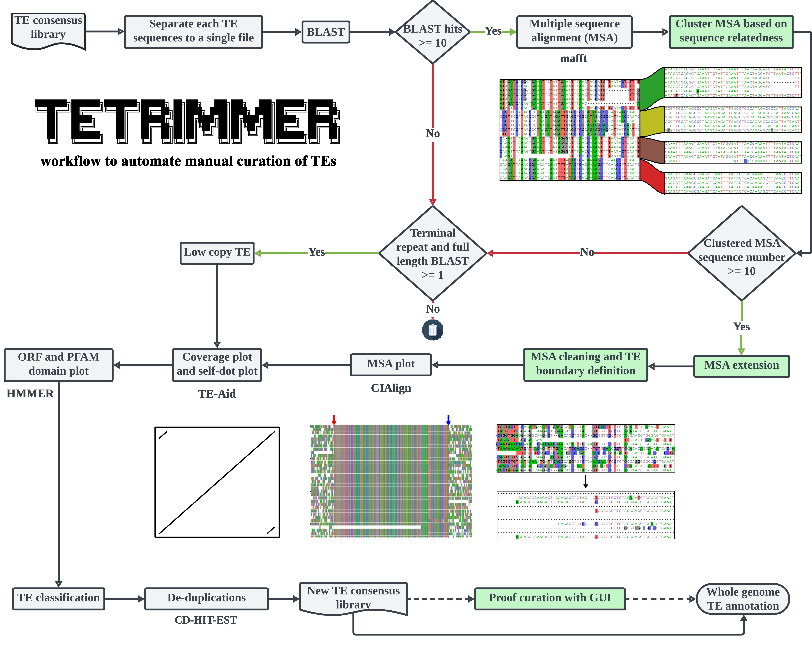
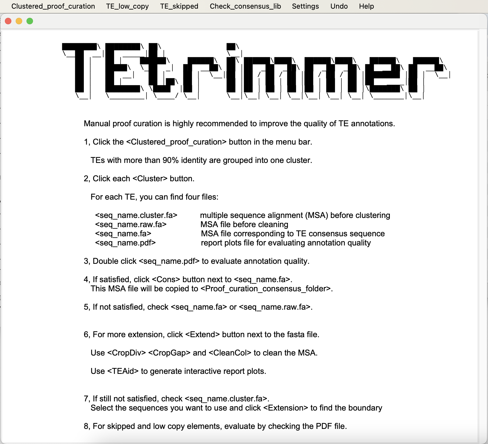
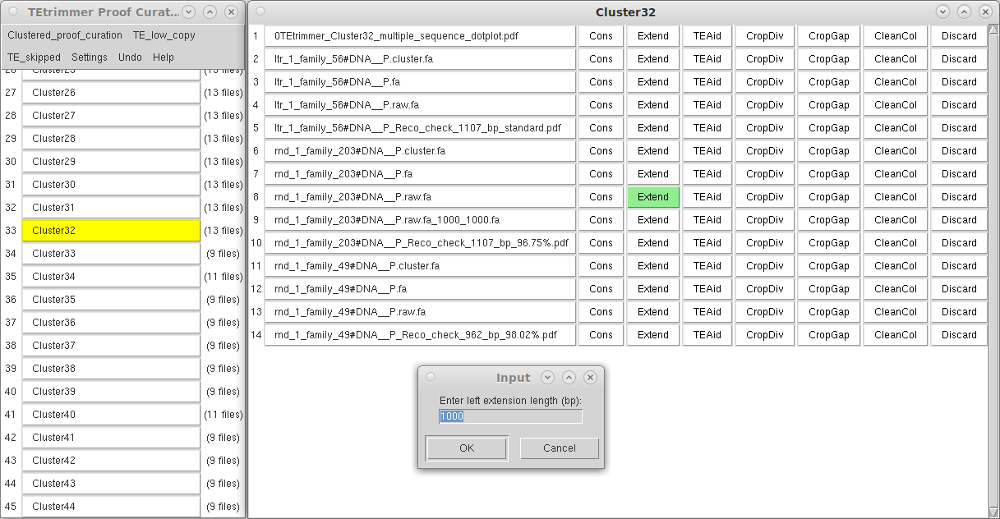

[](https://anaconda.org/bioconda/tetrimmer)
[](https://quay.io/repository/biocontainers/tetrimmer?tab=tags&tag=1.4.0--hdfd78af_0)
[](./LICENSE)
[](./docs/TEtrimmerv1.4.0Manual.pdf)


## Contents
- [Introduction](#Introduction)
- [Installation](#Installation)
- [Usage](#Usage)
  - [Test](#Test)
  - [Hardware requirements](#Hardware-requirements)
  - [Inputs](#Inputs) 
  - [Outputs](#Outputs)
  - [Proof curation](#Proof-annotation)
- [All available options](#All-available-options)
- [Update history](#Update-history)
- [Citation](#Citation)

## Introduction
Many tools have been developed for the discovery and annotation of transposable elements (TEs). 
However, the high-quality TE consensus library construction still requires manual curation of TEs, 
which is time-consuming and needs experts with an in-depth understanding of TE biology. 


TEtrimmer is a powerful software designed to automate the manual curation of TEs. The input can be a TE library from 
*de novo* TE discovery tools, such as EDTA2 and RepeatModeler2, or a TE library from closely related species. 
For each input consensus sequence, TEtrimmer automatically performs BLAST,  sequence extraction, extension, 
multiple sequence alignment (MSA), MSA clustering, MSA cleaning, TE boundary definition, and TE classification. 
TEtrimmer also provides a graphical user interface (GUI) to inspect and improve predicted TEs, which can assist 
achieving manual curation-level TE consensus libraries easily. 




## Manual
For detailed instructions, including installation steps, usage options, example outputs, and more, 
please refer to [TEtrimmerv1.4.0Manual.pdf](https://github.com/qjiangzhao/TEtrimmer/blob/main/docs/TEtrimmerv1.4.0Manual.pdf) 

## Installation
TEtrimmer can be installed by 1. Conda, 2. Singularity, or 3. Docker. 

### 1. Conda 
You have to install [miniconda](https://docs.anaconda.com/free/miniconda/) on your computer in advance. 
We highly recommend installation with `mamba`, as it is much faster. 

```commandline
# Create new conda environment
conda create --name TEtrimmer

# Install mamba 
conda install -c conda-forge mamba 

# Activate new environment
conda activate TEtrimmer

# Install TEtrimmer
mamba install bioconda::tetrimmer

# Display options of TETrimmer 
TEtrimmer --help

# If you encounter "ClobberError" or "ClobberWarning", don't worry! wait until it is finished!
# The Error or Warning could be like this:
ClobberError: This transaction has incompatible packages due to a shared path.
  packages: bioconda/osx-64::blast-2.5.0-boost1.64_2, bioconda/osx-64::rmblast-2.14.1-hd94f91d_0
  path: 'bin/blastx'

```
**or** See required dependencies [TEtrimmer_dependencies](https://github.com/qjiangzhao/TEtrimmer/blob/main/docs/TEtrimmer_dependencies).

**or** conda installation via .yml

```commandline
# Clone the github repository for TEtrimmer.
git clone https://github.com/qjiangzhao/TEtrimmer.git

# Install mamba 
conda install -c conda-forge mamba

# Install TEtrimmer by the "yml" file
mamba env create -f <path to/TEtrimmer_env_for_linux.yml>
```
Here is the provided [TEtrimmer_env_for_linux.yml](https://github.com/qjiangzhao/TE-Trimmer/blob/main/TEtrimmer_env_for_linux.yml)

### 2. Singularity
```commandline
# Download and generate TEtrimmer "sif" file
singularity pull docker://quay.io/biocontainers/tetrimmer:1.4.0--hdfd78af_0

# Run TEtrimmer based on sif file 
# If <your_path_to_store_PFAM_database> doesn't contain PFAM database
# TEtrimmer can automatically download PFAM to <your_path_to_store_PFAM_database>

singularity exec --writable-tmpfs \
--bind <your_path_contain_genome_file>:/genome \
--bind <your_path_contain_input_TE_library_file>:/input \
--bind <your_output_path>:/output \
--bind <your_path_to_store_PFAM_database>:/pfam \  
<your_path_contain_sif_file>/tetrimmer_1.4.0--hdfd78af_0.sif \
TEtrimmer \
-i /input/<TE_library_name.fasta> \
-g /genome/<genome_file_name.fasta> \
-o /output \
--pfam_dir /pfam \
-t 20 --classify_all
```
### 3. Docker 
```commandline
# Download TEtrimmer docker image
docker pull quay.io/biocontainers/tetrimmer:1.4.0--hdfd78af_0
docker run -it --name TEtrimmer -v <bind_your_path>:/data quay.io/biocontainers/tetrimmer:1.4.0--hdfd78af_0
# Then you can run TEtrimmer inside TEtrimmer container
# Please note: Run TEtrimmer via Docker is relatively slower than Conda and Singularity. 
```

## Hardware requirements
System: Linux, macOS, Windows WSL

RAM:
- For HPC Linux user, enough RAM needs to be assigned. We highly recommend running TEtrimmer on HPC with at least 40 threads and assigning at least 5 GB RAM to each thread.


| Threads | RAM    |
|---------|--------|
| 40      | 200 GB |
| 100     | 600 GB |

- Windows and macOS PC users can use Virtual Memory. Simply assign 20 threads to push the CPU to its limits. We did tests on a Macbook Pro (2020 M1 chip, 16 GB RAM) and compared with HPC, you can find the running time here:

| Query sequence number | Platform       | Threads | RAM                    | Run time |
|-----------------------|----------------|---------|------------------------|--------------| 
| 1700                  | Macbook Pro M1 | 20      | 16 GB + Virtual Memory | 50 hours     |
| 1700                  | HPC            | 40      | 150 GB                 | 5 hours      | 

- We have not tested it on the WLS of Windows, but it should be feasible to run TEtrimmer on it as well given sufficient resources. 

## Test
```commandline
# To see all options 
TEtrimmer --help
```
**or**
```commandline
# To see all options 
python <path to TEtrimmer>/TEtrimmer.py --help
```
- Download the test files [test_input.fa](https://github.com/qjiangzhao/TEtrimmer/blob/main/tests/test_input.fa) and [test_genome.fasta](https://github.com/qjiangzhao/TEtrimmer/blob/main/tests/test_genome.fasta).

```commandline
TEtrimmer --input_file <path to test_input.fa> \
          --genome_file <path to test_genome.fasta> \
          --output_dir <output directory> \
          --num_threads 20
          --classify_all                                          
```
## Inputs
- **Genome file**: The genome sequence in FASTA format (.fa or .fasta).
- **TE consensus library**: TEtrimmer uses the TE consensus library from *de novo* TE annotation tools, like `RepeatModeler` or `EDTA`, as input. 
For this reason, you have to run `RepeatModeler` or other TE annotation software first.

```commandline
# TEtrimmer package already includes RepeatModeler. Below is an exmpale command of running RepeatModeler.
# Build genome database index files
BuildDatabase -name <genome_file_database_name> <genome_file.fa>

# Run RepeatModeler
RepeatModeler -database <genome_file_database_name> \
              -threads 20 \
              -LTRStruct
# Then you will get the TE_consensus_library.fa file
```

Example:

```commandline
TEtrimmer --input_file <TE_consensus_library.fa> \
          --genome_file <genome_file.fa> \
          --output_dir <output_directory> \
          --num_threads 20 \
          --classify_all                       
```
If you want to **continue the analysis based on previous unfinished results in the same directory:**:
```commandline
TEtrimmer --input_file <TE_consensus_library.fa> \
          --genome_file <genome_file.fa> \
          --output_dir <directory_contains_previous_unfinished_results> \
          --num_threads 20 \
          --classify_all \
          --continue_analysis
```
If you want to **combine files from different sources for the input file, we recommend removing duplicate sequences 
before processing. This step can potentially save overall run time in the input file** (TEtrimmer only accepts single file
input, you have to combine files in advance):
```commandline
TEtrimmer --input_file <TE_consensus_library.fa> \
          --genome_file <genome_file.fa> \
          --output_dir <output_directory> \
          --num_threads 20 \
          --classify_all
          --dedup    
```
More options are available:
```commandline
  --classify_unknown              Use RepeatClassifier to classify the consensus sequence if the input
                                  sequence is not classified or is unknown or the processed sequence
                                  length by TEtrimmer is 2000 bp longer or shorter than the query
                                  sequence.
                                  
  --cons_thr FLOAT                The minimum level of agreement required at a given position in the
                                  alignment for a consensus character to be called. Default: 0.8
                                  
  --mini_orf INTEGER              Define the minimum ORF length to be predicted by TEtrimmer. Default:
                                  200

  --max_msa_lines INTEGER         Set the maximum number of sequences to be included in a multiple
                                  sequence alignment. Default: 100
                                  
  -ga, --genome_anno              Perform genome TE annotation using RepeatMasker with the TEtrimmer
                                  curated TE libraries.

```
## Outputs
- 📁**Classification** - *This folder is used for TE classifications.*  
- 📁**Multiple_sequence_alignment** - *All raw files will be stored in this folder if < --debug > is enabled.*
  - 📄**error_file.txt** - *Error file to store all error messages, only visible if errors were found.*
- 📁**Single_fasta_files** - *All sequences in the input file will be separated into single FASTA files and stored here.*
- 📁**TEtrimmer_for_proof_curation** - *This folder contains files used for manual inspection of TEtrimmer annotations.* 
  - 📁**Annotation_perfect** - *Four files are associated with each sequence (anno.fa; fa; pdf).*
    - 📄**TE_name.raw.fa** - *Multiple sequence alignment file before cleaning.*
    - 📄**TE_name.fa** - *Multiple sequence alignment file after cleaning.*
    - 📄**TE_name.pdf** - *Plot file used to evaluate output.*
    - 📄**TE_name.cluster.fa** - *Multiple sequence alignment file before clustering.*
  - 📁**Annotation_good** 
  - 📁**Annotation_check_recommended**
  - 📁**Annotation_check_required**
  - 📁**Clustered_proof_curation** - *The folder group processed TEs to different clusters based on TE consensus sequence similarity.*
  - 📁**TE_low_copy** - *This folder contains low copy TEs.*
  - 📁**TE_skipped** - *Contains TE_Aid plots for all skipped TEs.*
  - 📁**TEtrimmer_proof_anno_GUI** - *The folder contains graphical user interface tools for manual proof curation.*
    - 📄**annoGUI.py** - *Use <python ./annoGUI.py -g <genome.fa>> to start manual proof curation GUI.*
- 📁**HMM** - *This folder is used to store Hidden Markov Model file. Only visible when < --hmm > is enabled.*
- 📄**Sequence_name_mapping.txt** - *This file connects the input sequence names with the modified names from TEtrimmer.*
- 📄**summary.txt** - *Summary file.* 
- 📄**TEtrimmer_consensus.fasta** - *TE consensus library file before de-duplication.*
- 📄**TEtrimmer_consensus_merged.fasta** - *TE consensus library file after de-duplication.*


## Optional!!! Manual inspection of TEtrimmer outputs by provided GUI
You can use this graphical user interface (GUI) tool to inspect and improve TEtrimmer generated TE consensus library. 
This step is optional! TEtrimmer output can be used for genome-wide TE annotation directly. 
If you want to get a traditional manual-curation level TE consensus library, you have to perform this step. 


MSA files can be inspected by double-clicking the corresponding file button. 
```commandline
# Use --help to see all options
python <path_to_GUI_folder>/annoGUI.py --help

# To start the manual inspection GUI tool
# Open your Linux, macOS, or Windows terminal and type
python <output_directory>/TEtrimmer_for_proof_curation/TEtrimmer_proof_anno_GUI/annoGUI.py -g <genome.fa>
# Note: You have to make BLAST available. 
```
You can easily check and improve TEtrimmer outputs and get manual curation level TE consensus library.

TEtrimmer GUI tool can extend MSA, generate interactive plots, and clean MSA.



## Example report plots for each output TE consensus sequence
For each TEtrimmer output TE consensus sequence. You will get a report plot file like this:


## Acknowledgements
Many thanks to all the people who contributed to the TEtrimmer development. 

## All available options 
```commandline
Options:
  -i, --input_file TEXT           Path to TE consensus file (FASTA format). Use the output from
                                  RepeatModeler, EDTA, REPET, et al.  [required]

  -g, --genome_file TEXT          Path to genome FASTA file (FASTA format).  [required]

  -o, --output_dir TEXT           Path to output directory. Default: current working directory.
  
  -s, --preset [conserved|divergent]
                                  Choose one preset config (conserved or divergent).

  -t, --num_threads INTEGER       Thread number used for TEtrimmer. Default: 10

  --classify_unknown              Use RepeatClassifier to classify the consensus sequence if the input
                                  sequence is not classified or is unknown or the processed sequence
                                  length by TEtrimmer is 2000 bp longer or shorter than the query
                                  sequence.

  --classify_all                  Use RepeatClassifier to classify every consensus sequence. WARNING:
                                  This may take a long time.

  -ca, --continue_analysis        Continue from previous unfinished TEtrimmer run and would use the
                                  same output directory.
  --dedup                         Remove duplicate sequences in input file.

  -ga, --genome_anno              Perform genome TE annotation using RepeatMasker with the TEtrimmer
                                  curated TE libraries.

  --hmm                           Generate HMM files for each processed consensus sequence.

  --debug                         debug mode. This will keep all raw files. WARNING: Many files will be
                                  generated.

  -pd, --pfam_dir TEXT            Pfam database directory. TE Trimmer will download the database
                                  automatically. Only turn on this option if you want to use a local
                                  PFAM database or the automatic download fails.

  --cons_thr FLOAT                The minimum level of agreement required at a given position in the
                                  alignment for a consensus character to be called. Default: 0.8

  --mini_orf INTEGER              Define the minimum ORF length to be predicted by TEtrimmer. Default:
                                  200

  --max_msa_lines INTEGER         Set the maximum number of sequences to be included in a multiple
                                  sequence alignment. Default: 100

  --top_msa_lines INTEGER         If the sequence number of multiple sequence alignment (MSA) is
                                  greater than <max_msa_lines>, TEtrimmer will first sort sequences by
                                  length and choose <top_msa_lines> number of sequences. Then,
                                  TEtrimmer will randomly select sequences from all remaining BLAST
                                  hits until <max_msa_lines>sequences are found for the multiple
                                  sequence alignment. Default: 100

  --min_seq_num INTEGER           The minimum blast hit number required for the input sequence. We do
                                  not recommend decreasing this number. Default: 10

  --min_blast_len INTEGER         The minimum sequence length for blast hits to be included for further
                                  analysis. Default: 150

  --max_cluster_num INTEGER       The maximum number of clusters assigned in each multiple sequence
                                  alignment. Each multiple sequence alignment can be grouped into
                                  different clusters based on alignment patterns WARNING: using a
                                  larger number will potentially result in more accurate consensus
                                  results but will significantly increase the running time. We do not
                                  recommend increasing this value to over 5. Default: 2

  --ext_thr FLOAT                 The threshold to call “N” at a position. For example, if the most
                                  conserved nucleotide in a MSA columnhas proportion smaller than
                                  <ext_thr>, a “N” will be called at this position. Used with
                                  <ext_check_win>. The lower the value of <ext_thr>, the more likely to
                                  get longer the extensions on both ends. You can try reducing
                                  <ext_thr> if TEtrimmer fails to find full-length TEs. Default: 0.7

  --ext_check_win TEXT            the check windows size during defining start and end of the consensus
                                  sequence based on the multiple sequence alignment. Used with
                                  <ext_thr>. If <ext_check_win> bp at the end of multiple sequence
                                  alignment has “N” present (ie. positions have similarity proportion
                                  smaller than <ext_thr>), the extension will stop, which defines the
                                  edge of the consensus sequence. Default: 150

  --ext_step INTEGER              the number of nucleotides to be added to the left and right ends of
                                  the multiple sequence alignment in each extension step. TE_Trimmer
                                  will iteratively add <ext_step> nucleotides until finding the TE
                                  boundary or reaching <max_ext>. Default: 1000

  --max_ext INTEGER               The maximum extension in nucleotides at both ends of the multiple
                                  sequence alignment. Default: 7000

  --gap_thr FLOAT                 If a single column in the multiple sequence alignment has a gap
                                  proportion larger than <gap_thr> and the proportion of the most
                                  common nucleotide in this column is less than <gap_nul_thr>, this
                                  column will be removed from the consensus. Default: 0.4

  --gap_nul_thr FLOAT             The nucleotide proportion threshold for keeping the column of the
                                  multiple sequence alignment. Used with the <gap_thr> option. i.e. if
                                  this column has <40% gap and the portion of T (or any other)
                                  nucleotide is >70% in this particular column, this column will be
                                  kept. Default: 0.7

  --crop_end_div_thr FLOAT        The crop end by divergence function will convert each nucleotide in
                                  the multiple sequence alignment into a proportion value. This
                                  function will iteratively choose a sliding window from each end of
                                  each sequence of the MSA and sum up the proportion numbers in this
                                  window. The cropping will continue until the sum of proportions is
                                  larger than <--crop_end_div_thr>. Cropped nucleotides will be
                                  converted to -. Default: 0.7

  --crop_end_div_win INTEGER      Window size used for the end-cropping process. Used with the
                                  <--crop_end_div_thr> option. Default: 40

  --crop_end_gap_thr FLOAT        The crop end by gap function will iteratively choose a sliding window
                                  from each end of each sequence of the MSA and calculate the gap
                                  proportion in this window. The cropping will continue until the sum
                                  of gap proportions is smaller than <--crop_end_gap_thr>. Cropped
                                  nucleotides will be converted to -. Default: 0.1

  --crop_end_gap_win INTEGER      Define window size used to crop end by gap. Used with the
                                  <--crop_end_gap_thr> option. Default: 250

  --start_patterns TEXT           LTR elements always start with a conserved sequence pattern.
                                  TEtrimmer searches the beginning of the consensus sequence for these
                                  patterns. If the pattern is not found, TEtrimmer will extend the
                                  search of <--start_patterns> to up to 15 nucleotides from the
                                  beginning of the consensus sequence and redefine the start of the
                                  consensus sequence if the pattern is found. Note: The user can
                                  provide multiple LTR start patterns in a comma-separated list, like:
                                  TG,TA,TC (no spaces; the order of patterns determines the priority
                                  for the search). Default: TG

  --end_patterns TEXT             LTR elements always end with a conserved sequence pattern. TEtrimmer
                                  searches the end of the consensus sequence for these patterns. If the
                                  pattern is not found, TEtrimmer will extend the search of
                                  <--end_patterns> to up to 15 nucleotides from the end of the
                                  consensus sequence and redefine the end of the consensus sequence if
                                  the pattern is found. Note: The user can provide multiple LTR end
                                  patterns in a comma-separated list, like: CA,TA,GA (no spaces; the
                                  order of patterns determines the priority for the search). Default:
                                  CA

  --help                          Show this message and exit.
```
The TEtrimmer GUI can also be used to check other TE consensus libraries like the TE library directly from EDTA2,
RepeatModeler2, REPET, and other tools. 
```commandline
# Use --help to see all options
python <path_to_GUI_folder>/annoGUI.py --help

# Open your Linux, macOS, or Windows terminal and type
python <path_to_GUI_folder>/annoGUI.py -g <genome.fa> -clib <TE_consensus_library.fa>
# Note: The GUI doesn't perfectly support Windows for "TEAid" plotting function.
# To run the GUI tool, you only need to install BLAST. You do not need to install other packages required by TEtrimmer.
```


## Update history
**TEtrimmer v1.4.0 Released June.27.2024**

TEtrimmer GUI can be used to inspect and improve any TE consensus library.
Modified DBSCAN parameter to improve MSA clustering result. 

**TEtrimmer v1.3.0 Released May.28.2024**

Integrated "Extend", "TEAid", and MSA cleaning buttons into TEtrimmer GUI. "TEAid" can generate interactive plots, which
can help identifying TE boundaries.

## Citation
Qian, J., Xue, H., Ou, S., Storer, J., Fürtauer, L., Wildermuth, M. C., Kusch, S., & Panstruga, R. **bioRxiv** (2024) https://doi.org/10.1101/2024.06.27.600963
TEtrimmer: A novel tool to automate the manual curation of transposable 2 elements.

